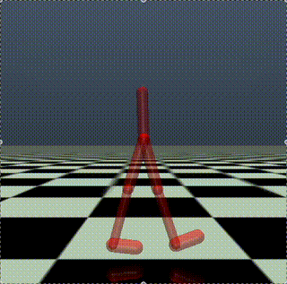
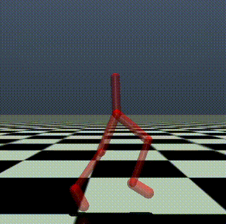
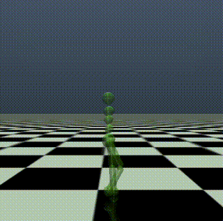
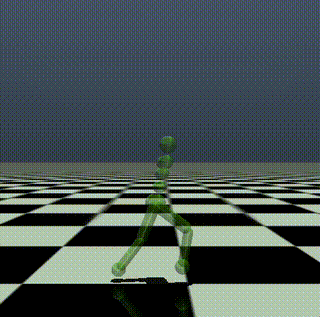

# Topics in Computer Graphics: Human Motion - Spring 2025

This repository contains the skeleton code for Assignment #2 of the SNU Human Motion course.  
It is based on the [Walker2d-v5 & Humanoid3d-v5](https://github.com/Farama-Foundation/Gymnasium) environment from OpenAI Gymnasium, and demonstrates training using PPO from [Stable-Baselines3](https://stable-baselines3.readthedocs.io/en/master/).

## ⚠️ IMPORTANT NOTES

[16:34 04/16] Skeleton code updated (Adjusted the range of thigh joints in custom_walker2d_ref.xml)

[15:26 04/19] For '2D Bipedal with References', when comparing `ref_pos[1] (=obs[11])` and `obs[1]`, make sure to compare `ref_pos[1] + 1.25` with `obs[1]` due to the reference height offset in the model.

[15:26 04/19] Fix bug in update_ref_pose.

## Installation

We have tested this code on Ubuntu 22.04 and macOS M1.

```bash
# Create a virtual environment
cd {project_folder}
python3.10 -m venv venv
source ./venv/bin/activate

# Install dependencies
pip install "stable_baselines3[extra]>=2.0.0a9"
pip install "gymnasium[mujoco]"
```

## Training

Train a controller using Deep Reinforcement Learning (PPO).  
The trained model will be saved in the `checkpoints/` folder as a `.zip` file.

```bash
# Add --use_3d to train with 3d character
# Use --motion flag to set the motion
python learning.py --use_3d --motion {motion_path}
```

### Hyperparameters

You can modify hyperparameters for PPO  under `policy_kwargs` in `learning.py`(Refer to the Stable-Baselines3 PPO documentation (https://stable-baselines3.readthedocs.io/en/master/modules/ppo.html) for available options).

## Rendering

Simulate the trained model.

```bash
# --model: path to the trained model
python rendering.py --model {model_path} (--use_3d) (--motion {motion_path})
```

## Logging

Training logs are saved in the `logs/` directory. You can visualize them with TensorBoard:

```bash
tensorboard --logdir=logs
```

## Environment Descriptions
 
### 2D Bipedal with References




#### Action Space (R^6)

The action space is 6-dimensional (R^6) and controls joint torques:

| Index Range | Description    | Elements                             |
|-------------|----------------|--------------------------------------|
| [0:3]       | Right leg      | thigh_joint, leg_joint, foot_joint   |
| [3:6]       | Left leg       | thigh_left_joint, leg_left_joint, foot_left_joint |

#### Observation Space (R^27)

| Index Range | Description                      | Elements                                 |
|-------------|----------------------------------|------------------------------------------|
| [0:3]       | Root position and orientation    | root_x_pos, root_z_pos, root_angle       |
| [3:9]       | Joint angles                     | Angles of all joints                     |
| [9:18]      | Reference pose                   | Target joint positions and angles        |
| [18:21]     | Root velocities                  | root_x_vel, root_z_vel, root_angular_vel |
| [21:27]     | Joint angular velocities         | Angular velocities of all joints         |

*Note: You can modify the observation space as needed, as long as you don't directly modify the character's physical information.*


#### Environment Details

For default termination conditions and other specifications, please refer to:
https://gymnasium.farama.org/environments/mujoco/walker2d/

### 3D Bipedal with References



#### Action Space (R^11)

The action space is 11-dimensional (R^11) and controls joint torques:

| Index Range | Description       | Elements                             |
|-------------|-------------------|--------------------------------------|
| [0:3]       | Abdomen joints    | abdomen_z, abdomen_y, abdomen_x      |
| [3:7]       | Right leg joints  | right_hip_x, right_hip_z, right_hip_y, right_knee |
| [7:11]      | Left leg joints   | left_hip_x, left_hip_z, left_hip_y, left_knee |


#### Observation Space (R^53)

| Index Range | Description                      | Elements                                 |
|-------------|----------------------------------|------------------------------------------|
| [0:3]       | Root position                    | root_x_pos, root_y_pos, root_z_pos       |
| [3:7]       | Root quaternion orientation      | qw, qx, qy, qz                           |
| [7:18]      | Joint angles                     | Angles of all joints                      |
| [18:36]     | Reference pose                   | Target joint positions and orientations   |
| [36:42]     | Root velocities                  | Linear and angular velocities of root     |
| [42:53]     | Joint angular velocities         | Angular velocities of all joints          |

*Note: You can modify the observation space as needed, as long as you don't directly modify the character's physical information.*


#### Environment Details

For default termination conditions and other specifications, please refer to:
https://gymnasium.farama.org/environments/mujoco/humanoid/

### Customization

You can customize the Observation, Reward, and Termination Condition in `custom_walker2d.py` & `custom_humanoid3d.py`.  We recommend modifying the sections marked with `TODO`.

Note: Do not modify the XML file path or environment parameters in `__init__`. Test will be based on the default environment setup.


## Motion Data 

The motion data came from repository https://github.com/lsw9021/MASS.git.
